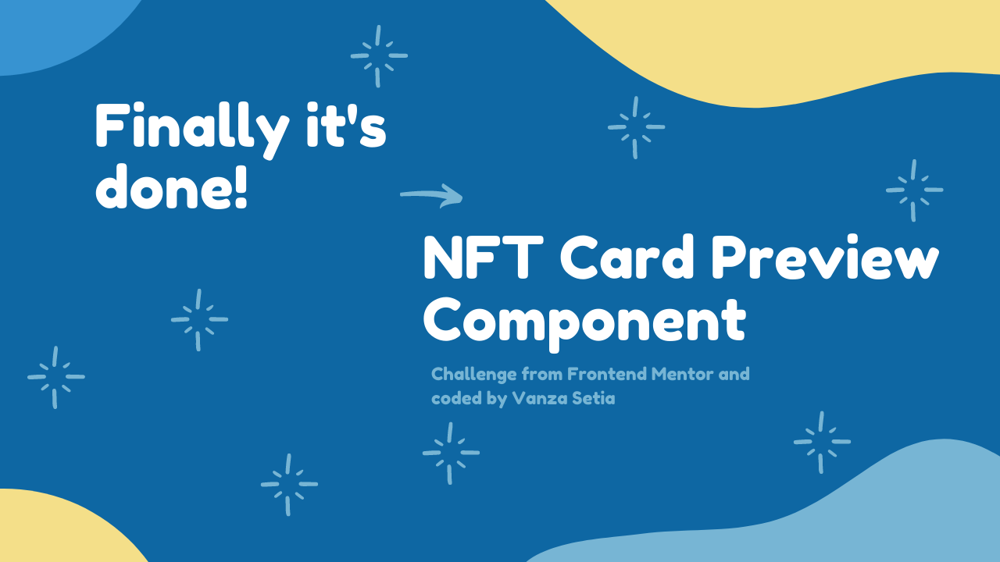
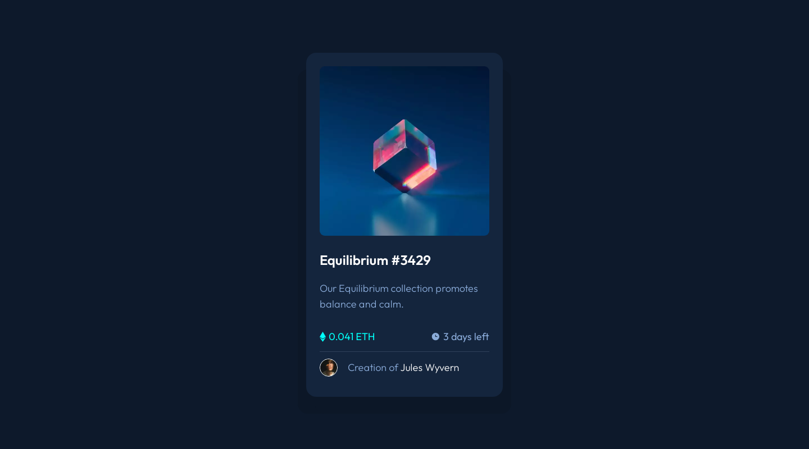
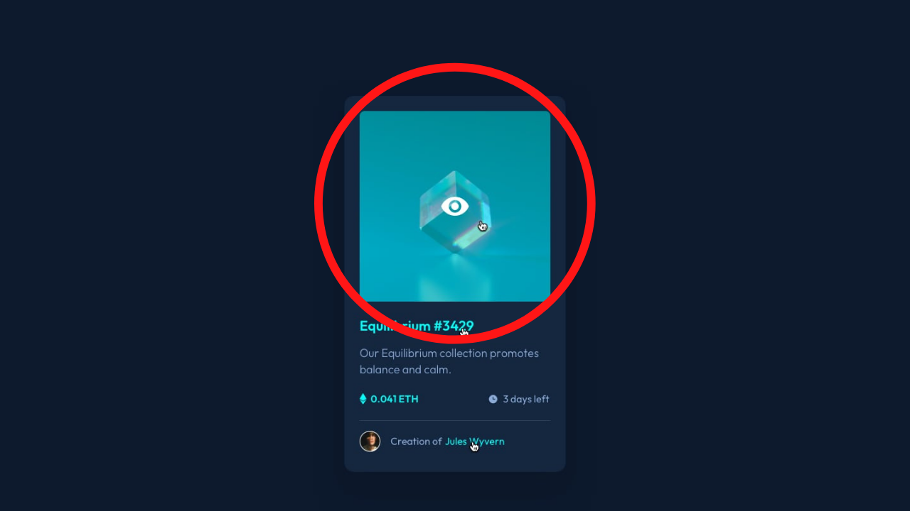

<p align="left">
  <a href="https://www.frontendmentor.io/challenges?difficulties=1" target="_blank"></a>
  
  <a href="https://twitter.com/vanzasetia" target="_blank"></a>
  
  
  
</p>

<p>
  <a href="http://jigsaw.w3.org/css-validator/check/referer">
    
    </a>
</p>

# NFT Preview Card Component

## Table of contents
- [Overview](#overview)
  - [Introduction](#introduction)
  - [The challenge](#the-challenge)
  - [Links](#links)
  - [Screenshots](#screenshots)
- [My process](#my-process)
  - [Built with](#built-with)
  - [What I learned](#what-i-learned)
    - [Better Performance](#better-performance)
    - [Less Markup](#less-markup)
- [Author](#author)
- [License](#license)
- [References](#references)

## Overview
[(Back to top)](#table-of-contents)

### Introduction
Welcome to the `README.md` of this repo! The purpose of creating this project is to sharpen my coding skill.

In this file I'm going to tell you everything, start from tools that I used, and much more.

That's it for the introduction and **happy reading!**

### The Challenge
My challenge is to build out this preview card component and get it looking as close to the design as possible.

My users should be able to:

* View the optimal layout depending on their device's screen size
* See hover states for interactive elements
* Comfortably navigate the website using screen reader and keyboard

### Links
- [🌐 Live Review](https://nftcardfrontendmentor.netlify.app/)
- [👨‍🏫 Frontend Mentor Solution Page](https://www.frontendmentor.io/solutions/nft-card-preview-component-html-css-sass-GeV9Ozwqb)

### Screenshots




## My Process
[(Back to top)](#table-of-contents)

### Built With
- **Following best practices**\* 
- HTML Semantic Tags
- [BEM (Block, Element, Modifier)](https://sparkbox.com/foundry/bem_by_example) Class *Naming Convention*
- [Sass](https://sass-lang.com/)
- CSS Flexbox
- Mobile-first workflow
- [Normalize.css](https://necolas.github.io/normalize.css/)

> I follow guidelines. [See what guidelines that I follow.](./docs/README.md#guidelines)

### What I Learned


#### Better Performance

The Frontend Mentor has provided me with optimized asset, but there is another way to optimized it to another level, which is using the `webp` image.

The WebP image is smaller than the JPG, PNG, which means that my website can load even faster and safe user cellular data.

But, the problem with WebP images are they are not widely supported yet, meaning that if the user browser don't know about the WebP images, then those images won't show up.

So, to solve the problem I need `picture` tag. With `picture` tag I can make the browsers that support WebP images can load those images, while for the older browsers that don't support WebP images or even the `picture` will still be able to load the `img` tag.

```html
<picture>
  <source
    srcset="/images/equilibrium.webp"
    type="image/webp"
  />
  
</picture>
```

> Note: The tool to convert the normal images (PNG, JPG, etc) are on the [documentation](./docs/README.md#tools)

#### Less Markup

##### The Problem
In this challenge there is one thing that is *tricky* to do, which is the eye and cyan background overlay.



##### Worst Solution
The worst approach, that I could think of is by using HTML markup to create the overlay and the eye icon and then style it to make it look the same as on the design.

```html
<a href="/images/equilibrium.jpg" class="card__preview">
  <picture>
    <source
      srcset="/images/equilibrium.webp"
      type="image/webp"
    />
    
  </picture>
  <div class="card__overlay">
    
  </div>
</a>
```

This is tough to style since the to do list:
1. I have to make the `card__overlay` have full width and height by using absolute positioning.
2. Then, I have to make the eye icon in the middle of the overlay by using `transform` property and absolute positioning.
3. I have to set the `display` of the overlay.

Too much things to do for simple task.

##### Best Solution
After thinking for quite sometime, I decided to use CSS `background` property to handle the overlay and the eye icon at the same time.

And here how it works:
1. The HTML markup is very simple. Now, I could just delete the `div` and `img` tags.
```html
<a href="/images/equilibrium.jpg" class="card__preview">
  <picture>
    <source
      srcset="/images/equilibrium.webp"
      type="image/webp"
    />
    
  </picture>
</a>
```
> Note: Since I'm using WebP image, I have to use `picture` element to support all browsers.
2. Now the styling part. All I had to do was using pseudo element and `background` shorthand property to handle everything.
```css
.card__preview {
  position: relative;
  display: block;
}

.card__preview::after {
  content: "";
  position: absolute;
  top: 0;
  right: 0;
  bottom: 0;
  left: 0;
}

.card__preview:hover::after,
.card__preview:active::after {
  background: rgba(0, 255, 247, 0.6) url("../icons/view.svg") center/3rem no-repeat;
}
```

As you can see, I am able to manage the overlay with a simple CSS styling.

## Author
[(Back to top)](#table-of-contents)

- Frontend Mentor - [@vanzasetia](https://frontendmentor.io/profile/vanzasetia)
- Twitter - [@vanzasetia](https://twitter.com/vanzasetia)
- Code Newbie - [@vanzasetia](https://community.codenewbie.org/vanzasetia)
- Want to see me on other platform? [Check my linktree!](https://linktr.ee/vanzasetia)

## License
[(Back to top)](#table-of-contents)

>You can check out [the full license](./LICENSE)

This project is licensed under the terms of the MIT license.

For those of you who are wondering, why do I need to license this? 
- Well, first it's free 😁.
- Second I checked this [Choose license website](https://choosealicense.com/) to help me chose a license.
- The last reason, if I don't want to choose a license, then [here's what gonna happen](https://choosealicense.com/no-permission/).

## References

[(Back to top)](#table-of-contents)

> See the [documentation.](./docs/README.md)
